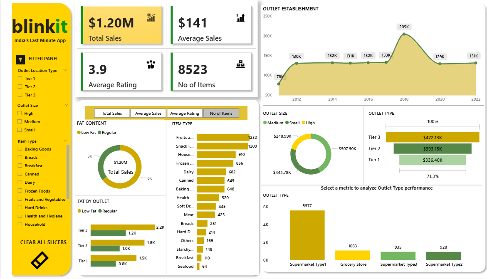

# Blinkit Analysis Dashboard

## Project Overview
This Power BI dashboard analyzes Blinkit's sales and outlet performance across different product types, outlet characteristics, and item metrics. It provides actionable insights into sales trends, outlet performance, and item popularity, with interactive features for dynamic exploration.

## Dataset Overview
The dataset contains sales information for Blinkit items with the following columns:

- **Item Identifier**  
- **Item Type**  
- **Outlet Establishment Year**  
- **Outlet Identifier**  
- **Outlet Location Type**  
- **Outlet Size**  
- **Outlet Type**  
- **Item Visibility**  
- **Item Weight**  
- **Sales**  
- **Rating**  

The data was lightly cleaned using **Power Query**:  
- Standardized fat content labels (e.g., "LF"/"low fat" → "Low Fat", "reg" → "Regular")  
- Checked column quality to ensure consistency

## Key KPIs (Calculated Using Measures)
- Total Sales  
- Average Sales  
- Average Rating  
- Number of Items

## Charts & Visuals
1. **Donut Chart:** Total Sales by Fat Content *(using KPI metrics)*  
2. **Bar Chart:** Total Sales by Item Type *(using KPI metrics)*  
3. **Stacked Column Chart:** Fat Content by Outlet for Total Sales *(using KPI metrics)*  
4. **Line Chart:** Total Sales by Outlet Establishment Year  
5. **Donut Chart:** Sales by Outlet Size  
6. **Funnel Chart:** Total Sales by Outlet Type  
7. **Stacked Column Chart:** All metrics by Outlet Type  

**Interactive Features:**  
- Slicers for Outlet Location Type, Outlet Size, and Item Type for dynamic filtering  

## Insights
- Medium-sized outlets show higher overall sales.  
- Tier 3 outlets contribute significantly to total sales.  
- Fruits & Vegetables and Household items perform strongly across multiple outlet types.  

## Tools & Skills Used
- **Power BI**  
- **DAX** (for KPI measures)  
- **Power Query** (for data cleaning and transformation)

